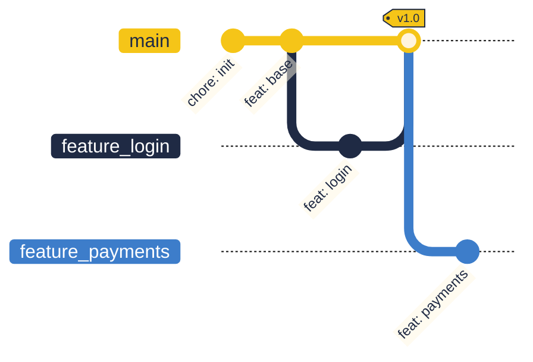

<p align="center">
  
</p>

<h1 align="center">GitBob</h1>

<p align="center">A natural-language Git copilot, powered by IBM Bob</p>

<p align="center"><b><a href="USAGE.md">📖 Setup &amp; Test Guide →</a></b> &nbsp;|&nbsp; new here? start there</p>

> Built for the **IBM Bob Hackathon**. Bob is the agent (the brain).
> GitBob is the hands: a small MCP server that gives Bob **safe,
> explained, confirmable git superpowers** in *any* repository.

## The problem

Git is where developers lose time and work: panicked recoveries from a
bad reset/rebase, hand-writing commit messages, untangling branches
before a PR, and — for newcomers — not understanding a repo's history
at all. A plain LLM will happily guess `git reset --hard` and destroy
your work, because it can't see your actual repository.

## The idea

**GitBob makes IBM Bob a git expert for your real repo.** You talk to
Bob in plain English. Bob — running in a custom **👷 GitBob** mode —
reads the *actual* repository state through GitBob's MCP tools, explains
what it found, proposes the exact commands with their risk, and only
acts after you approve. Destructive operations require a second,
explicit confirmation. Remove Bob and nothing works: **Bob does all the
reasoning, planning, and recovery** — GitBob just gives it safe hands.

```
You ──"I committed to main by accident"──▶  Bob (👷 GitBob mode)
                                              │  reads real repo state
                                              │  via GitBob MCP tools
                                              ▼
                              explains + proposes exact commands + risk
                                              │
                                       you approve ▼
                              GitBob runs git, gates destructive ops,
                              verifies the result, recovers on failure
```

## Why Bob is central (hackathon criterion)

- There is **no hardcoded NL→git parser anywhere**. Bob is the agent.
- The GitBob mode is locked to `["read", "mcp"]` — Bob's *only* path to
  git is GitBob's audited, gated tools. No raw shell, no file edits.
- Intent understanding, multi-step planning, error recovery, commit
  messages, and onboarding narratives are **all Bob**.

## Install

```bash
pip install gitbob          # or: pipx install gitbob
cd your/repo
gitbob init                 # kit + AGENTS.md; writes a PATH-proof server command
gitbob doctor               # sanity-check + verify Bob can spawn the server
```

Open the repo in IBM Bob, reload the window, pick the **👷 GitBob**
mode, and ask in plain English.

## What `gitbob init` installs

| File | Purpose |
|---|---|
| `.bob/mcp.json` | Registers the `gitbob` MCP server; auto-approves the 6 read-only tools |
| `.bob/custom_modes.yaml` | The 👷 GitBob mode (restricted to `read` + `mcp`) |
| `.bob/rules-gitbob/*.md` | Workflow, safety, and onboarding rules Bob loads in this mode |
| `AGENTS.md` | Persistent context so Bob knows GitBob is available |

## The three flagship scenarios

1. **Rescue** — *"I accidentally committed to main, move it to a feature
   branch."* Bob reads `git_reflog`/`git_status`, proposes the recovery
   sequence, flags it destructive, confirms, executes, verifies.
2. **Automation** — *"Stage everything and write a good commit
   message."* Bob reads the real diff and writes a Conventional Commits
   message, then commits on approval.
3. **Onboarding** — *"Explain how the branches relate and what's safe to
   delete."* Bob reads the repo and briefs you like a senior teammate.
   Read-only — nothing is changed.

## The MCP tools

Read-only (auto-approved): `git_status`, `git_log`, `git_diff`,
`git_branches`, `git_reflog`, `git_repo_overview`.
Gated: `git_run` — runs only `git`, rejects shell injection, and forces
an explicit confirmation token for destructive plans.

## Timeline visual

`git_timeline` (and the timeline attached to a successful `git_run`) returns
the **real repository topology** as a branded Mermaid `gitGraph` that Bob
renders live in chat: a signature **yellow trunk lane**, navy/blue feature
lanes, and a "corporate Memphis" palette. Branches split off as alternate
timelines and visibly converge on merge, so history reads at a glance. It is
pure, client-side-themed Mermaid text — no images, no extra dependency —
which is also why it can never destabilise the MCP server.



## Develop

```bash
python -m venv .venv && .venv/Scripts/python -m pip install -e ".[]" pytest
.venv/Scripts/python -m pytest -q          # unit tests
.venv/Scripts/python scripts/smoke_client.py   # end-to-end MCP stdio test
```

MIT licensed.
